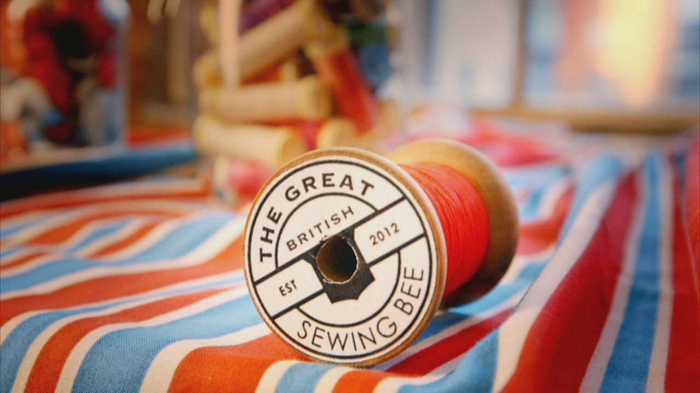

# sewing-bee

🧵 Data on the [Great British Sewing Bee](https://www.bbc.co.uk/programmes/b03myqj2)

🧵 Sourced from [Wikipedia](https://en.wikipedia.org/wiki/The_Great_British_Sewing_Bee).

🧵 Inspiration from the [bakeoff](https://github.com/apreshill/bakeoff) package

🧵 Tables:

- series
- sewers
- ratings
- challenge_names
- episodes
- results
