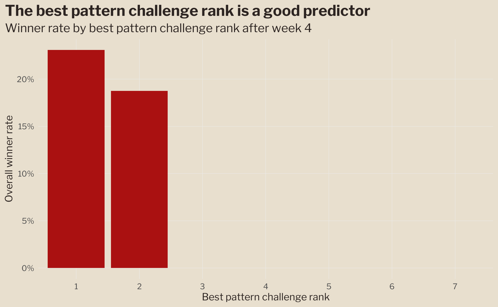
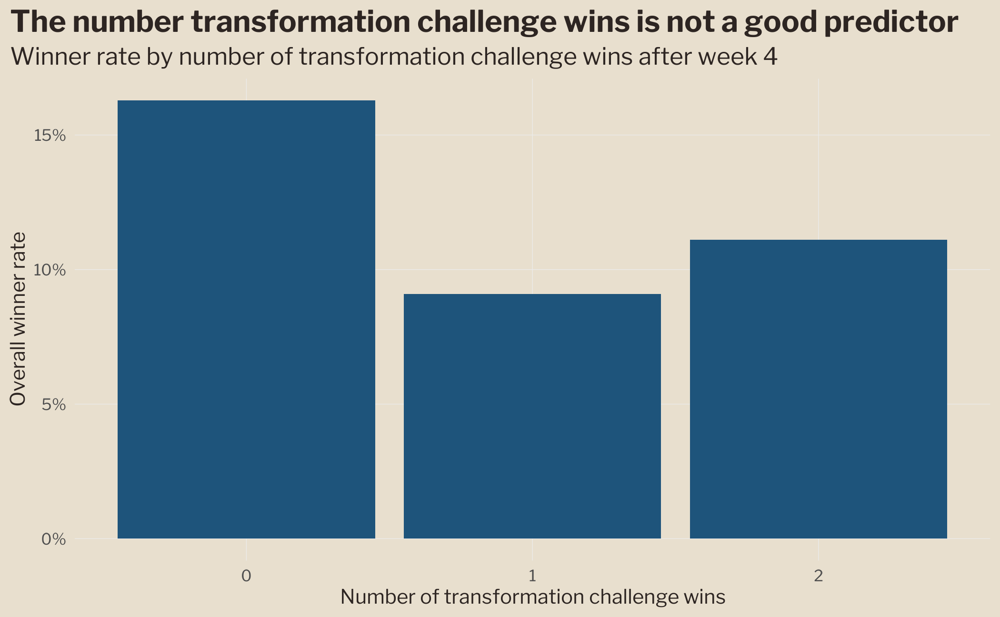
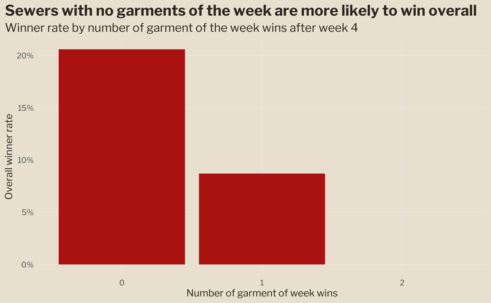
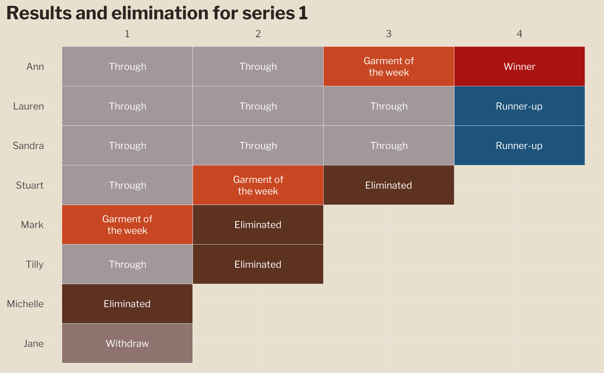
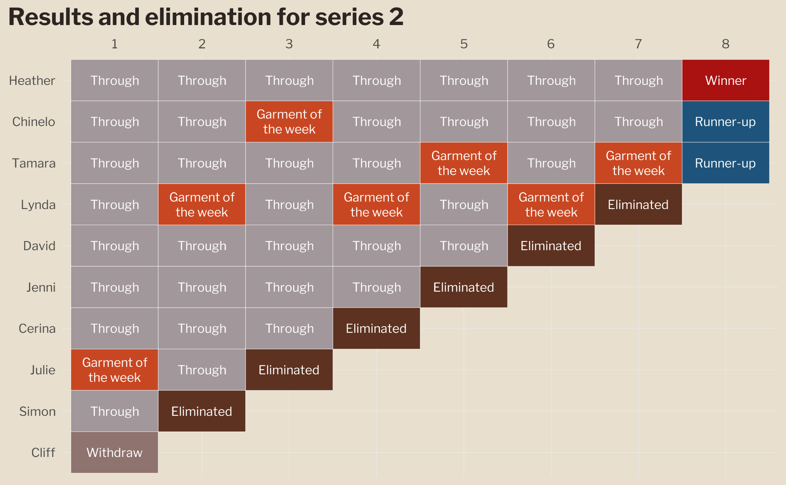
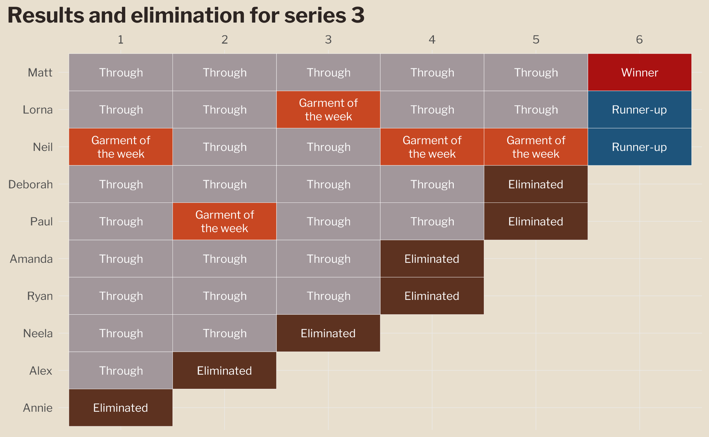
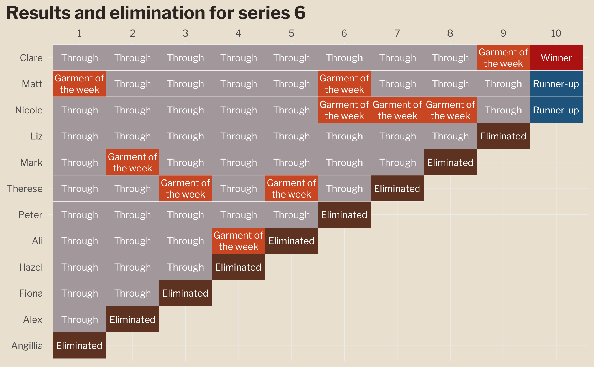

# sewing-bee

🧵 Data on the [Great British Sewing Bee](https://www.bbc.co.uk/programmes/b03myqj2)

🧵 Sourced from [Wikipedia](https://en.wikipedia.org/wiki/The_Great_British_Sewing_Bee).

🧵 Inspiration from the [bakeoff](https://github.com/apreshill/bakeoff) package

## 🧵 Tables:

- series ✓
- sewers ✓
- ratings ✓
- results ✓
- challenge_names ✓
- episodes ✓
- episode themes ✓

## 🧵 New skills to be gained

- editing Wikipedia pages (to make the table formats consistent over the seasons) ✓
- using [{rvest}](https://rvest.tidyverse.org/) package to extract data from web pages ✓
- using [{eyedroppeR}](https://gradientdescending.com/select-colours-from-an-image-in-r-with-eyedropper/) package to extract a colour palette from a picture ✓
- using a badge in the `readme.md` file ([shields.io](https://shields.io/badges)) ✓
- contributing a dataset to [TidyTuesday](https://github.com/rfordatascience/tidytuesday) 
  using {[tidytuesdayR](https://dslc-io.github.io/tidytuesdayR/articles/curating.html)}

# 🧵 Overall winner rates by standing after episode 4

This looks at the rankings and wins for the first four episodes 
for the sewers that lasted until then, to see the likelihood of becoming the
overall winner.

## 🧵 Viewership charts

Inspired by the bakeoff recipes, here are 10 ways of looking at the same viewership data.

## 🧵 Elimination and results charts

